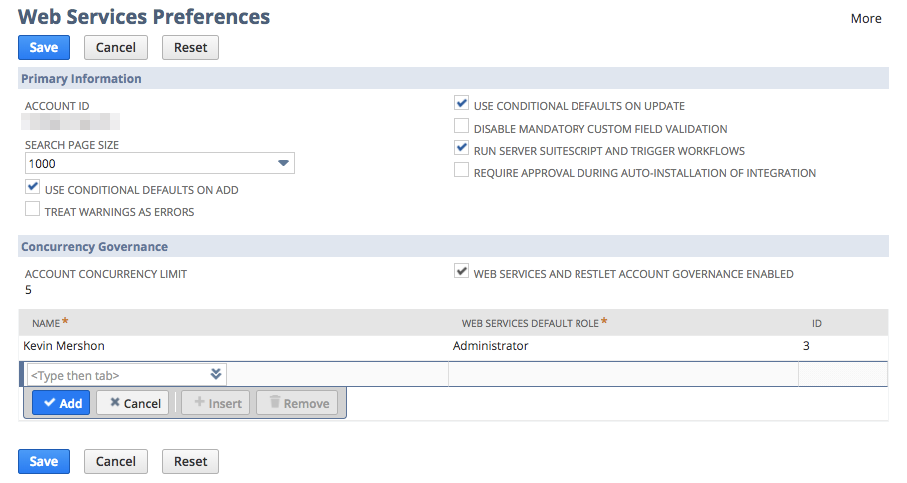

Netsuite SuiteScript 2.0 Project Skeleton
==

Dependencies
--
* NodeJS 8.9.1

Installation
--
`npm install -g mocha yarn && yarn install`

Developing
--
Run the following while you are developing to continuously execute tests.

  `gulp watch-tests`

Configuration
--
In order to deploy to NetSuite, you will need to configure your account
credentials in `credentials.json`, and your user must be an Administrator of
the NetSuite account you are attempting to deploy to.

1. Copy or rename `credentials-sample.json` to `credentials.json`
2. Go to `Setup > Integration > Web Services Preferences` in your NetSuite account.
3. Copy the `ACCOUNT ID` value to your `credentials.json` file under `account`,
  and fill in all other appropriate values for `role`, `email`, and `password`.
4. Add your user account as an authorized user of the Web Services API, similar to this:

  

Deploying
--
Run the command `gulp deploy-sandbox` to deploy to your Sandbox account.

License
--
AGPLv3
